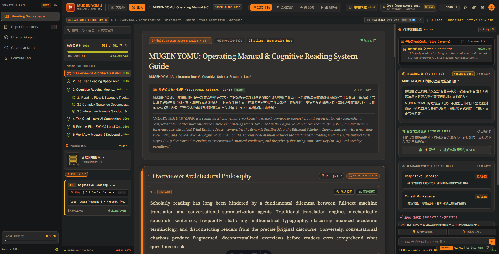

# MUGEN YOMU (無限閱讀)

> 為深度理解而生的沉浸式學術論文與技術文件 AI 伴讀工具。



---

## 💡 設計動機與理念 (Motivation & Philosophy)

在生成式 AI 蓬勃發展的時代，雖然各類工具（如 NotebookLM）能快速產出摘要並大幅節省閱讀時間，但**「理解脈絡」與思維推導的過程依然是摘要無法取代的**。摘要能告訴你結論，卻不能代替大腦建立深層的知識架構與思考能力。

**MUGEN YOMU (無限閱讀)** 的初衷不是為了取代閱讀，而是打造一款專注於「深度理解」的 AI 伴讀（Copilot）工具：

1. **脈絡大於結論**：AI 不只給出簡短摘要，更能針對學術論文進行白話解釋、長難句精準拆解與批判性導讀，保留知識的完整推論鏈。
2. **手眼引導進入心流（Flow State）**：
   > 《如何閱讀一本書》中提到：「用手指引導視線閱讀，眼睛會自然跟隨指尖移動，能顯著減少視線回跳並大幅提升專注與沉浸感。」
   
   我們將此閱讀心理學原理數位化——結合工程師熟悉的 **Vim 鍵盤導航** 與動態游標（Smear Cursor），讓指尖在鍵盤上的敲擊節奏化為閱讀引導線，幫助讀者迅速進入專注的閱讀心流。

---

## ✨ 核心功能特色 (Key Features)

| 功能亮點 | 說明 |
| :--- | :--- |
| 🎯 **指尖引導的心流閱讀**<br>*(Vim Navigation & Smear Cursor)* | 支援原生 Vim 鍵位控制（`j`/`k` 行與段落移動、`h`/`l` 字元定位），結合平滑動態拖尾游標，引導視覺焦點、告別視線迷航。 |
| 🧠 **深度解構與伴讀導師**<br>*(Deep Comprehension AI)* | 具備**白話解釋**、**長難句拆解**與**學術精準翻譯**三大功能，並能提出批判性問題與原文對照，協助吃透硬核內容。 |
| 📄 **論文與技術文件支援**<br>*(Academic Papers & PDF Reader)* | 內建完整 PDF 解析引擎（基於 `pdfjs-dist`），可自由載入學術論文與技術規範 PDF，並提供經典論文範例快速上手。 |
| 🌐 **雙語同步閱讀模式**<br>*(Bilingual Reading Mode)* | 原文與譯文段落即時同步滾動、高亮對齊，隨時相互參照，兼顧理解速度與原文嚴謹性。 |
| 🔑 **自主控管與隱私安全**<br>*(BYOK - Bring Your Own Key)* | 採用 Bring Your Own Key 模式（支援 Groq 等高速推理 API），由使用者完全掌控自己的金鑰與呼叫額度，隱私更安心。 |
| 🎨 **豐富主題與現代設計**<br>*(Rich Themes & Glassmorphism UI)* | 擺脫枯燥單調的黑白畫面，提供暗色、亮色、護眼等多款主題，搭配精緻的現代玻璃擬態（Glassmorphism）與微動畫，長時間閱讀依然舒適愉悅。 |
| ⚡ **進度追蹤與本地快取**<br>*(Reading Tracker & Local Cache)* | 即時統計已閱讀段落與進度；AI 伴讀分析結果支援本地快取，再次重訪不浪費 Token 與等待時間。 |

---

## ⌨️ Vim 鍵盤導航與快捷鍵操作 (Vim Navigation)

MUGEN YOMU 內建專為閱讀場景調校的 **Neovim 風格狀態列** 與鍵盤導引系統，讓視線隨指尖流暢穿梭：

### 1. 焦點移動與導航
| 快捷鍵 | 動作說明 |
| :---: | :--- |
| <kbd>j</kbd> / <kbd>k</kbd> | **垂直下移 / 上移一行**（到達段落邊界時自動切換至相鄰段落） |
| <kbd>h</kbd> / <kbd>l</kbd> | **水平左移 / 右移一個字元**（自動過濾不可見標籤） |
| <kbd>w</kbd> / <kbd>b</kbd> | **跳至下一詞 / 上一詞**（Word Forward / Backward） |
| <kbd>0</kbd> / <kbd>$</kbd> | **跳至當前行首 / 當前行末** |
| <kbd>g</kbd><kbd>g</kbd> | **跳至章節最首段**（連續按兩次 <kbd>g</kbd>） |
| <kbd>G</kbd> | **跳至章節最末段** (<kbd>Shift</kbd> + <kbd>g</kbd>) |

### 2. 閱讀伴讀與互動操作
| 快捷鍵 | 動作說明 |
| :---: | :--- |
| <kbd>t</kbd> | **展開 / 收合**當前焦點段落的繁體中文翻譯 |
| <kbd>a</kbd> | **喚醒 AI 伴讀導師**，針對當前段落進行白話解析與長句拆解 |
| <kbd>y</kbd> | **複製當前段落原文**或 LaTeX 數學公式至剪貼簿（Yank） |
| <kbd>?</kbd> | **開啟 / 關閉** 浮動 Vim 快捷鍵速查卡 (Cheat Sheet) |
| <kbd>Esc</kbd> | **關閉** 速查卡、全螢幕燈箱或彈出式視窗 |

> 💡 **小提示**：可在設定面板中自訂 **游標動態彈跳強度 (Bounce Strength)** 與 **閃爍模式 (Cursor Blink)**，打造最契合您閱讀節奏的視覺體驗。

---

## 🛠️ 技術堆疊 (Tech Stack)

- **前端框架**：[Astro 5](https://astro.build/) + [Svelte 5](https://svelte.dev/)
- **文件解析與渲染**：`pdfjs-dist`、`KaTeX`（數學公式排版）
- **樣式與介面**：現代 Vanilla CSS、動態主題系統（Themes System）、Glassmorphism UI
- **AI 整合**：Groq API Client (LLaMA 3.3 等高速推理模型)
- **測試框架**：Playwright

---

## 🚀 安裝與執行 (Getting Started)

### 環境需求
- Node.js 20+

### 本地啟動
```bash
# 複製專案
git clone https://github.com/alvin999/mugen-yomu.git
cd mugen-yomu

# 安裝相依套件
npm install

# 啟動開發伺服器
npm run dev

# 建置正式版本
npm run build

# 本地預覽正式版本
npm run preview
```

---

## 📖 快速上手指南 (Quick Start)

1. **載入範例或自訂文件**：右上角可快速切換內建經典論文（如 Attention Is All You Need），或載入您自訂的技術文件與 PDF。
2. **啟用 Vim 導航模式**：於設定中開啟 Vim 游標，使用 `j` / `k` 在段落間流暢移動，體會指尖引導視線的專注感。
3. **呼叫 AI 深度伴讀**：按 <kbd>a</kbd> 或點選段落旁的 AI 伴讀按鈕，立即獲取該段落的白話拆解、長句結構剖析或譯文。
4. **切換雙語模式與主題**：在介面頂端隨時切換雙語對照模式，並挑選最適合您閱讀環境的主題配色。

---

## 📂 專案結構概覽 (Project Structure)

```text
src/
├── components/
│   ├── reader/        # 核心閱讀器、段落渲染、Vim 狀態列與雙語模式
│   ├── repository/    # 論文卡片、閱讀統計與管理元件
│   └── common/        # 燈箱、彈窗與通用 UI 元件
├── stores/            # Svelte 5 狀態管理 (Vim 游標、文件與進度)
├── services/          # AI 呼叫、快取服務與 PDF 解析
├── styles/            # 主題系統與全域樣式
└── data/              # 範例論文資料 (mockPapers)
```

---

## 🤝 參與貢獻 (Contributing)

歡迎透過 Issue 或 Pull Request 協助改進 MUGEN YOMU：
1. Fork 本倉庫
2. 建立功能分支 (`git checkout -b feat/amazing-feature`)
3. 確保代碼通過測試 (`npm run test`)
4. 提交 PR 並詳述改進內容

---

## 📄 授權條款 (License)

本專案採用 **MIT 授權**，詳見 `LICENSE` 檔案。

---

## 📬 聯絡資訊 (Contact)

- **作者**：Alvin (GitHub: [@alvin999](https://github.com/alvin999))
- **問題回報**：歡迎至 [GitHub Issues](https://github.com/alvin999/mugen-yomu/issues) 提交反饋或功能建議。